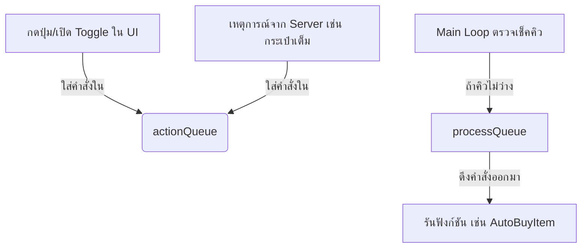

# คู่มืออธิบายโค้ด (Code Documentation) - Garden Horizons Optimizer

ไฟล์นี้อธิบายโครงสร้างและการทำงานของสคริปต์ `demo_opt.luau` ที่ผ่านการปรับปรุง (Refactor) เพื่อเพิ่มประสิทธิภาพและความเสถียร

---

## 🏗️ 1. โครงสร้างหลัก (Main Architecture)

สคริปต์ถูกแบ่งออกเป็น 5 ส่วนหลักเพื่อความเป็นระเบียบ (Modular Style):
1.  **Services & Variables**: การโหลด Library และประกาศตัวแปรเริ่มต้น
2.  **Utility Functions**: ฟังก์ชันช่วยงานทั่วไป (Tween, Teleport, Visibility)
3.  **Core Logic**: หัวใจการทำงาน (Harvest, Buy, Plant, Remove)
4.  **User Interface (UI)**: ส่วนแสดงผลและการตั้งค่าผ่าน Fluent UI
5.  **Hooks & Loops**: ส่วนรับเหตุการณ์จาก Server (Remotes) และลูปควบคุมหลัก

---

## 🔄 2. ระบบ Action Queue (หัวใจความเสถียร)

สคริปต์นี้ใช้ระบบ **Queue (คิว)** เพื่อป้องกันปัญหาตัวละครพยายามทำหลายอย่างพร้อมกันจนบั๊ก (เช่น เดินไปซื้อของพร้อมกับเดินไปเก็บเกี่ยว)

### ตัวแปรสำคัญ:
- `actionQueue`: ตารางเก็บรายการงานที่ต้องทำ
- `isProcessing`: ตัวคุมไม่ให้ Process ซ้อนกัน

---

## 🧩 3. ฟังก์ชันและการเชื่อมโยง (Functional Mapping)

### 🧺 การจัดการไอเทม (Consolidated Logic)
ในเวอร์ชันเก่าจะมีฟังก์ชันแยกซื้อเมล็ด ซื้ออุปกรณ์ แต่ในเวอร์ชันนี้ถูกยุบรวมเพื่อลดขนาดโค้ด:
- **`AutoBuyItem(ShopType, Items, DropdownValue)`**: 
  - *การเชื่อมโยง*: ถูกเรียกใช้โดย `tempBuySeed` และ `tempBuyGear`
  - *การทำงาน*: วาร์ปไปร้านค้า -> วนลูปซื้อตามจำนวนที่ตั้งไว้ -> วาร์ปกลับจุดเดิม

### 🚜 การขุดทิ้ง (Multi-purpose Remove)
- **`ProcessRemove(isFruit)`**: 
  - *การเชื่อมโยง*: ถูกเรียกใช้เมื่อเปิด Toggle `tgRemoveFruitEnable` หรือ `tgRemovePlantsEnable`
  - *กลไก*: ถ้าส่ง `true` จะขุดเฉพาะผลไม้ (Crops) ตามเงื่อนไข Weight/Variant ถ้าส่ง `false` จะขุดต้นแม่ (Plants) ตามเงื่อนไข Scale

### 🚀 การเคลื่อนที่ (Movement)
- **`TweenToTarget(targetCFrame, speed)`**: 
  - *การเชื่อมโยง*: ถูกใช้โดยระบบเก็บเกี่ยวและขุดทิ้ง
  - *ความปลอดภัย*: มีระบบ **Timeout (5 วินาที)** ถ้าเดินติดขัดเกินเวลา จะทำการ **SafeTeleport** ไปยังจุดหมายทันทีเพื่อป้องกันตัวละครค้าง

---

## ⚡ 4. ระบบลดแลค (Anti-Lag System)

เวอร์ชันนี้ถูกปรับปรุงให้ทำงานแบบ **Targeted Optimize** (เจาะจงเป้าหมาย):
- **เป้าหมาย**: โฟลเดอร์ `ClientPlants` และ `MapPhysical`
- **ข้อยกเว้น**: โฟลเดอร์ `Shops` (ร้านค้า) จะไม่ถูกลดทอนกราฟิก เพื่อให้ร้านค้ายังดูสวยงาม
- **การเชื่อมโยง**: ใช้ตัวแปร `AntiLagConnections` เก็บการเชื่อมต่อ `DescendantAdded` เพื่อให้วัตถุที่เกิดใหม่ (เช่น ปลูกต้นไม้ใหม่) ถูกลดแลคทันทีแบบ Real-time

---

## 🖥️ 5. วิธีใช้งาน (Usage Guide)

| แถบเมนู (Tab) | คำอธิบายการใช้งาน |
| :--- | :--- |
| **Main** | คุมระบบปลูกอัตโนมัติ (Auto Plants) และเก็บเกี่ยว (Auto Harvest) |
| **Shop** | เลือกซื้อเมล็ดและอุปกรณ์ (เลือกรายการจาก Dropdown ก่อนเปิด Toggle) |
| **Automatic** | ระบบทำเควส (Auto Claim Quest) และการขุดต้นไม้ทิ้งตามเงื่อนไข |
| **Misc** | ระบบลดแลค (Anti-Lag), การซ่อนต้นไม้/ผลไม้เพื่อประหยัด FPS, และ ESP |
| **Settings** | การบันทึก/โหลด Configuration ผ่าน SaveManager |

---

## ⚠️ 6. ระบบรักษาความปลอดภัย (Watch Dog)
ในลูปหลัก (Main Loop) จะมีระบบ **Watch Dog** ที่ทำงานทุกๆ 1 ชั่วโมง เพื่อเคลียร์ค่าตัวแปรและรีเซ็ตระบบ ESP ใหม่โดยอัตโนมัติ เพื่อป้องกันอาการ RAM เต็ม (Memory Leak) จากการเปิดสคริปต์ทิ้งไว้เป็นเวลานาน

---

*เอกสารคำแนะนำนี้จัดทำขึ้นเพื่อช่วยให้ทำความเข้าใจโครงสร้างที่ซับซ้อนของเวอร์ชัน Optimizer ได้ง่ายขึ้น*
